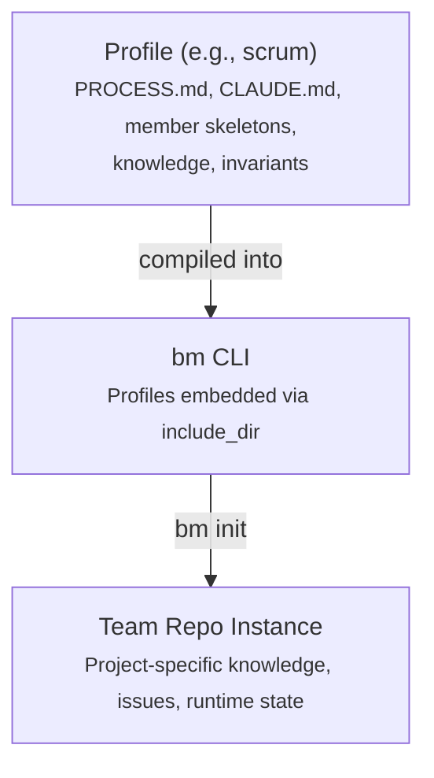
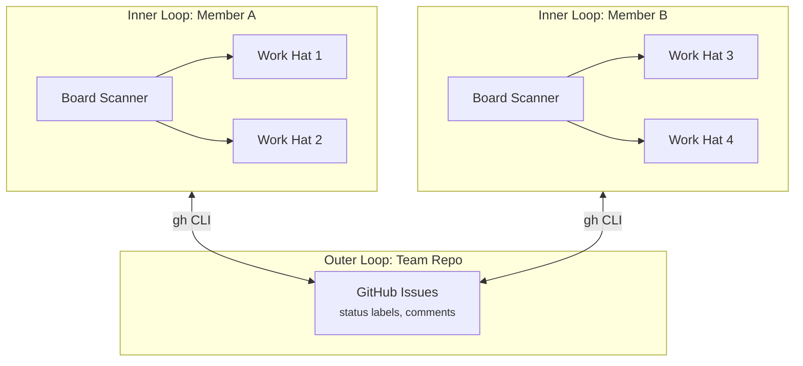

# Architecture

BotMinter's architecture has two fundamental models: a **profile-based generation model** that produces team repos, and a **two-layer runtime model** that governs how agents operate.

## Profile-based generation model

The `bm` CLI embeds profiles at compile time. When you run `bm init`, it extracts a profile's content into a new team repo:

| Layer | Location | What lives here | Who changes it |
|-------|----------|-----------------|----------------|
| **Profile** | `profiles/<name>/` | Team process, role definitions, member skeletons, norms | Profile authors |
| **Team repo instance** | e.g., `~/workspaces/my-team/team/` | Project-specific knowledge, hired members, runtime state | Team operators (via `bm` CLI) |



### Layer examples

| Content | Layer | Rationale |
|---------|-------|-----------|
| PROCESS.md (issue format, labels, workflow) | Profile | Defines how this type of team works |
| Member skeletons (role definitions) | Profile | Roles are methodology-specific |
| Team knowledge (commit conventions, PR standards) | Profile | Methodology norms |
| Project-specific knowledge (e.g., architecture docs) | Team repo instance | Not reusable across teams |

### Feedback loop

Learnings flow in both directions:

```
Profile <-- Team repo instance
(frequent)    (continuous)
```

- **Instance to Profile**: Non-project-specific learnings (process improvements, better prompts) flow back to the profile for reuse across teams.
- **Project-specific knowledge stays**: Project-specific learnings remain in the team repo instance.

## Two-layer runtime model

At runtime, the system operates in two nested loops:

### Inner loop — Ralph instances

Each team member is a full [Ralph orchestrator](https://github.com/mikeyobrien/ralph-orchestrator) instance with its own:

- **Hats** — specialized behaviors activated by events (defined by the profile)
- **Memories** — persistent state across sessions
- **Workflow** — event-driven loop with configurable persistence

Ralph handles hat selection, event routing, and the execution loop. Each agent runs independently in its own workspace.

### Outer loop — team repo control plane

The team repo is the coordination fabric. Members coordinate through:

- **GitHub issues** as work items
- **Status labels** (`status/<role>:<phase>`) to signal state transitions
- **Pull-based discovery** — each member scans for labels matching its role

No central orchestrator manages the outer loop. Coordination is emergent from shared process conventions defined in `PROCESS.md`. The specific roles, labels, and work item types are defined by the [profile](profiles.md).

### Execution models

Members support two execution models:

- **Poll-based** (`persistent: true`) — the member runs continuously, scanning the board on each loop cycle. Suitable for always-on operation.
- **Event-triggered** (`persistent: false`) — the member runs once, processes all matching work, then exits. An external [daemon](../reference/cli.md#daemon) restarts the member when new GitHub events arrive (via webhooks or API polling). This eliminates idle token burn.

See [Design Principles — Two Execution Models](../reference/design-principles.md#two-execution-models) for configuration details.



???+ example "Example: scrum runtime model"
    In the `scrum` profile, Member A is the `human-assistant` (board scanner, backlog manager, review gater) and Member B is the `architect` (board scanner, designer, planner, breakdown executor). The human-assistant watches for `status/po:*` labels and the architect watches for `status/arch:*` labels.

## Related topics

- [Workspace Model](workspace-model.md) — how agent workspaces are structured
- [Coordination Model](coordination-model.md) — pull-based work discovery
- [Profiles](profiles.md) — reusable team process definitions
- [Knowledge & Invariants](knowledge-invariants.md) — recursive scoping model
