# Profiles

A profile defines a team methodology — how the team is structured, what roles exist, what processes are followed, and what norms are enforced. Profiles are embedded in the `bm` binary at compile time and extracted when creating a team.

## What a profile contains

| Content | File/Directory | Purpose |
|---------|---------------|---------|
| Process definition | `PROCESS.md` | Issue format, label conventions, status transitions, communication protocols |
| Team context | `CLAUDE.md` | Agent orientation — what the repo is, workspace model, coordination model |
| Team knowledge | `knowledge/` | Shared norms (commit conventions, PR standards, communication protocols) |
| Team invariants | `invariants/` | Quality rules (code review required, test coverage) |
| Member skeletons | `members/` | Pre-configured role definitions with Ralph configs and prompts |
| Shared agents | `agent/` | Skills and sub-agents available to all members |
| Profile skills | `skills/` | Profile-level skills (e.g., `knowledge-manager` for interactive knowledge management) |
| Formations | `formations/` | Deployment targets (`local`, `k8s`) with formation configs and optional manager hats |
| Schema definition | `.schema/` | Expected directory layout for schema validation |

## The `scrum` profile

The primary profile that botminter ships. It defines a scrum-style team with:

- **Pull-based kanban** using GitHub issues and status labels
- **Emoji-attributed comments** for role identification
- **Training mode** for human-in-the-loop gating
- **Conventional commits** format
- **PR review standards** with approval requirements

### Available roles

| Role | Purpose | Hats |
|------|---------|------|
| `human-assistant` | PO's proxy — board scanning, backlog management, review gating | board_scanner, backlog_manager, review_gater |
| `architect` | Technical authority — design docs, story breakdowns, issue creation | board_scanner, designer, planner, breakdown_executor, epic_monitor |

Additional roles (dev, QE, reviewer) are planned for future milestones.

### Epic lifecycle

The `scrum` profile defines an epic lifecycle with status transitions:

```mermaid
flowchart LR
    triage["po:triage"] --> backlog["po:backlog"]
    backlog --> design["arch:design"]
    design --> dreview["po:design-review"]
    dreview -->|approve| plan["arch:plan"]
    dreview -->|reject| design
    plan --> preview["po:plan-review"]
    preview -->|approve| breakdown["arch:breakdown"]
    preview -->|reject| plan
    breakdown --> ready["po:ready"]
    ready --> inprog["arch:in-progress"]
    inprog --> accept["po:accept"]
    accept -->|approve| done["done"]
    accept -->|reject| inprog
```



### Views

Profiles define role-based views for the GitHub Project board. Since the API doesn't support creating views programmatically, views are defined in the profile and `bm projects sync` prints filter strings for manual setup in the GitHub UI.

```yaml
views:
  - name: "PO"
    prefixes: ["po"]
    also_include: ["done", "error"]
  - name: "Architect"
    prefixes: ["arch"]
    also_include: ["done", "error"]
```

Each view matches statuses by prefix (e.g., `["po"]` matches `po:triage`, `po:backlog`, etc.) and adds the `also_include` entries. Run `bm projects sync` to sync the Status field and see the full filter strings for each view.

## Listing profiles

Use the `bm` CLI to see available profiles:

```bash
bm profiles list                # Table of all embedded profiles
bm profiles describe scrum   # Detailed profile information
```

## Creating a new profile

Profiles live in `profiles/<name>/`. To create a new profile:

1. Create the profile directory under `profiles/`
2. Add a `botminter.yml` with name, display_name, description, version, schema_version, roles, labels, statuses, and views
3. Add a `.schema/` directory defining the expected directory layout
4. Add a `PROCESS.md` defining issue format, labels, and communication protocols
5. Add a `CLAUDE.md` providing team-wide context for agents
6. Add `knowledge/` with methodology-specific norms
7. Add `invariants/` with quality rules
8. Add `members/` with role skeleton directories
9. Add `skills/` with profile-level skills (e.g., `knowledge-manager`)
10. Add `formations/` with deployment targets (at minimum, `local/formation.yml`)

Each member skeleton needs:

| File | Purpose |
|------|---------|
| `ralph.yml` | Ralph orchestrator configuration (hats, events, persistence) |
| `PROMPT.md` | Role identity and cross-hat behavioral rules |
| `CLAUDE.md` | Role context (workspace model, knowledge paths, invariant paths) |
| `.botminter.yml` | Member metadata template (role name, emoji for comments) |

??? note "Alternative profiles: `scrum-compact` and `scrum-compact-telegram`"
    botminter also ships two compact profiles with a single "superman" agent wearing all hats:

    - **`scrum-compact`** (default) — Uses GitHub issue comments for human-in-the-loop (HIL) approval gates. The agent posts a review request comment, moves on to other work, and checks for the human's response on the next scan cycle. Non-blocking — no timeout, no risk of auto-approval.
    - **`scrum-compact-telegram`** — Uses Telegram (RObot) for blocking HIL approval gates via `human.interact`. The agent blocks the loop waiting for a response, then continues.

    Both compact profiles include skills and formations support.

## Profile reusability

Profiles are designed to be reusable across teams. Changes that apply to a methodology go in the profile, not in the generated team repo. For example:

- A better design review process → update `PROCESS.md` in the profile
- A new commit convention → update `knowledge/commit-convention.md` in the profile
- A new role → add a member skeleton in `members/`

Project-specific learnings (architecture patterns, codebase knowledge) stay in the team repo instance.

## Related topics

- [Architecture](architecture.md) — where profiles fit in the generation model
- [Knowledge & Invariants](knowledge-invariants.md) — recursive scoping model
- [Process Conventions](../reference/process.md) — full label scheme and issue format
- [Member Roles](../reference/member-roles.md) — detailed role definitions
